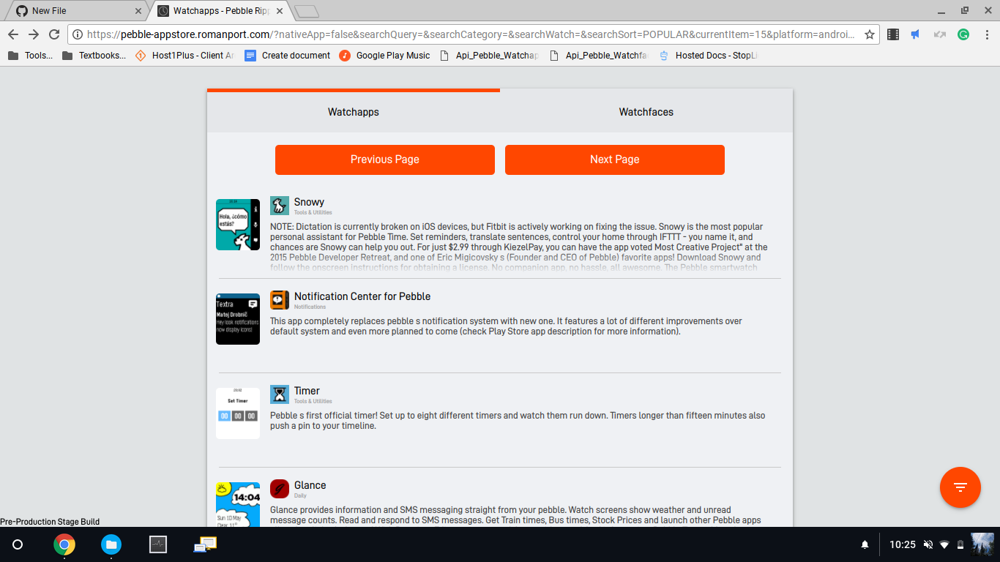
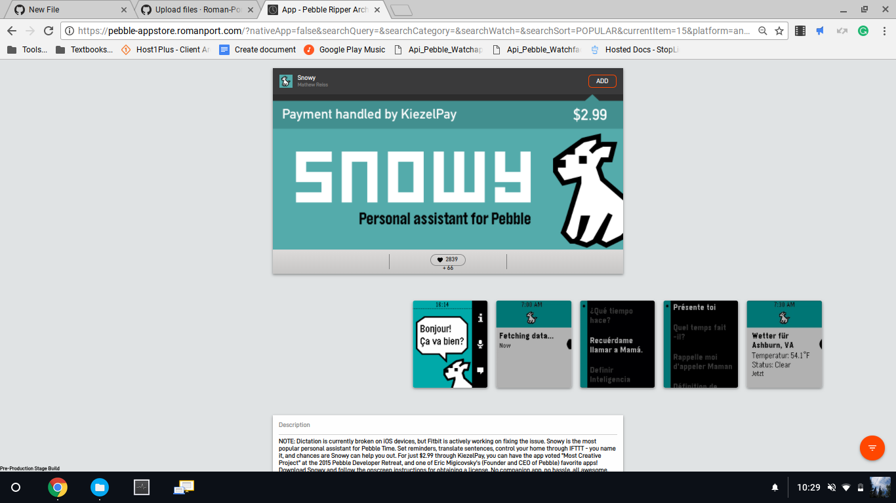
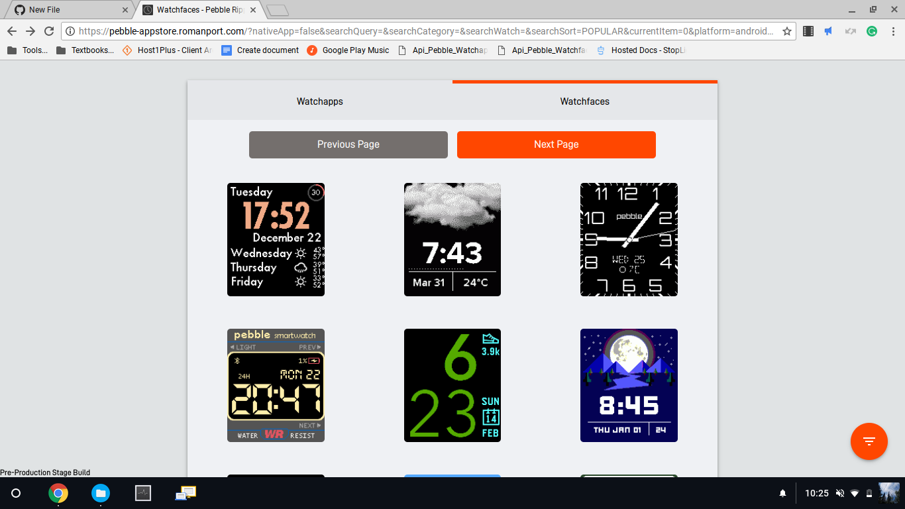
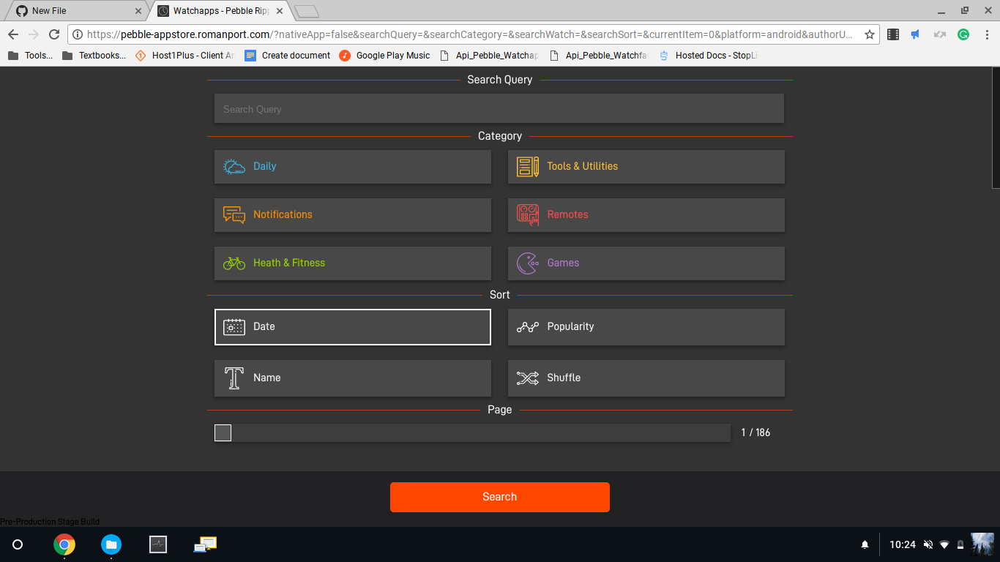

# THIS REPOSITORY IS NOT UP TO DATE!
If you'd like to use this appstore, you should access the work in progress version at https://pebble-appstore.romanport.com .

# RomanPort's Pebble Appstore
A replacement Pebble appstore I've been working on for the last few motnhs. It works in a web browser or the native Pebble app.

## State Of This Project
While this appstore is ready for release, it still needs optimization and bugfixes. I'm testing this on my own device and keeping an eye out for problems as I work on it. This website is public [over on my website](https://pebble-appstore.romanport.com).

## Using My Appstore On Your Own Pebble App
It's easy to set up! I'll put a quick link here soon to set it up right away, but in the mean time, [head over to Pebble-Config](https://pebble-config.romanport.com/) to get your own. (NOTE: This website looks like it's bugged on iOS.)

### Native 
This appstore supports all of the native features of the original appstore. Documentation for this will be released soon. Right now, downloading apps, setting the title bar, and more are supported by native. Check out /assets/v1/PblNative.js for more.

### Compatibility 
I developed this website on Chrome 65 and inside of the Pebble app on Android 7.0. iOS support hasn't been tested in quite some time, but I expect that it will work here.

Any version of IE is **confirmed incompatible**. Launching this website with IE will display an error.

### Screenshots
Here are some screenshots of the appstore running in a web browser.

